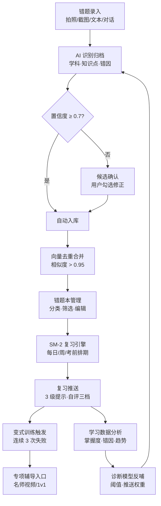
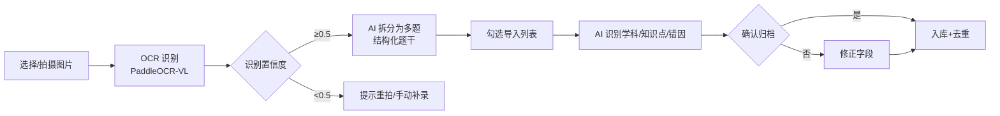
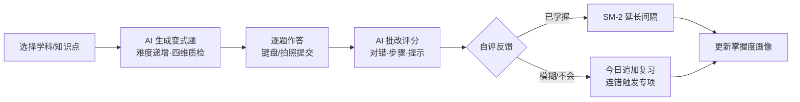
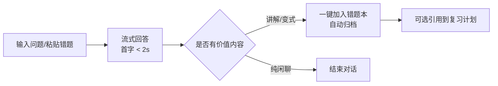
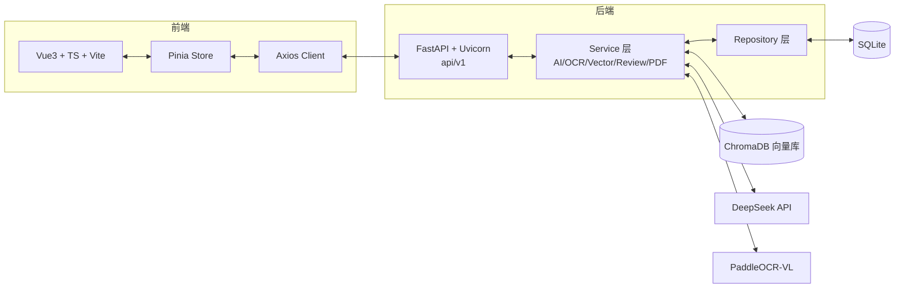

# Recall AI 智能错题本 · 产品需求文档(PRD)

| 项目 | 内容 |
|---|---|
| 文档版本 | v1.0 |
| 编写日期 | 2026-08-13 |
| 产品名称 | Recall AI 智能错题本 |
| 文档角色 | 产品需求文档(PRD) |
| 关联文档 | 业务流程设计 v2 / MVP 技术文档 / 竞品分析报告 / Web 信息架构 |

---

## 1. 产品背景与目标

### 1.1 市场背景

传统错题整理高度依赖手工抄写,单题耗时 3-5 分钟,且"整理完就不再翻开"。市面产品存在明显缺口:

| 竞品类型 | 代表 | 核心短板 |
|---|---|---|
| 整理工具 | 蜜蜂试卷 | "存"极致但不教不练,举一反三质量差 |
| 题库大厂 | 作业帮 / 小猿 | 题库海量但商业化过重、复习机制薄弱 |
| 记忆工具 | Anki | 算法科学但内容全靠自制、无教育语义 |

### 1.2 产品定位

> **比蜜蜂试卷更懂"学"、比作业帮更干净、比 Anki 更省心** —— 面向学生的 AI 错题管理平台,以"录入 10 秒、复习按计划、错因可解释"为核心体验,形成「录入 → 诊断 → 管理 → 复习 → 分析」完整学习闭环。

### 1.3 产品目标

| 层级 | 目标 | 衡量指标 |
|---|---|---|
| 北极星指标 | 周活跃复习率 | ≥ 35%(周内完成 ≥1 次复习的用户占比) |
| 用户价值 | 录入效率 | 单题录入 ≤ 10 秒(拍照/截图通道) |
| 学习效果 | 掌握度提升 | 连续使用 4 周后,平均掌握度提升 ≥ 15% |
| 留存 | 复习习惯 | 7 日留存 ≥ 40%;连续打卡 7 天用户占比 ≥ 20% |

### 1.4 产品原则

1. **AI 可解释**:诊断必须给出"为什么判这个知识点",可确认、可修正
2. **降级不阻塞**:AI/OCR/向量库任一不可用,录入等主链路不中断
3. **学习有激励**:连胜、打卡、掌握度可视化,对抗"整理即终点"的放弃心理

---

## 2. 目标用户画像

### 2.1 核心用户群

| 画像 | 特征 | 核心痛点 | 使用场景 | 关键诉求 |
|---|---|---|---|---|
| **高中生** | 15-18 岁,刷题量大,错题多 | 手工抄题耗时,错因不清 | 课后整理、考前冲刺 | 拍照快速录入、按知识点复习 |
| **大学生** | 18-24 岁,专业课+考研备考 | 资料分散,遗忘快 | 宿舍自习、图书馆 | 多学科管理、SM-2 智能排期 |
| **考研学生** | 20-25 岁,长周期备考 | 知识遗忘曲线,冲刺计划混乱 | 每日固定复习时段 | 考前计划、薄弱考点专项、变式训练 |

### 2.2 典型用户故事

- **高中生·小林(高二)**:数学圆锥曲线总丢分。用拍照 3 秒录错题,AI 自动识别出"联立方程判别式"是薄弱点,复习计划把它排进每天 3 题,两周后正确率明显提升。
- **考研生·小张(大三)**:复习科目多,怕遗忘。每晚打开 Recall 按 SM-2 计划复习 20 分钟,AI 对话讲解错题,考前一周生成冲刺错题集 PDF。
- **大学生·小陈(大二)**:不愿抄错题,以前错题随手丢。截图录题后 AI 自动归档学科与知识点,期末复习时按知识点导出 Markdown 笔记。

---

## 3. 业务核心逻辑

### 3.1 核心闭环总览

### 3.2 关键节点说明

| 节点 | 触发条件 | 处理逻辑 | 输出 | 异常分支 |
|---|---|---|---|---|
| A 录入 | 用户选择任一通道 | 图片走 OCR、对话走 AI 整理 | 结构化题干 | OCR 失败 → 手动补录;AI 不可用 → 降级文本 |
| B AI 识别 | 题干就绪 | 识别学科/知识点/错因/答案 | 识别结果卡片 | 无 Key → 提示手动填写,不阻塞 |
| C 置信度判定 | 识别完成 | ≥0.7 直通,否则进候选 | 入库或候选列表 | — |
| E 去重 | 入库前 | 向量相似度 >0.95 合并 | 去重标记 | 向量库不可用 → 跳过 |
| G 复习排期 | 每日 0 点/用户打开 | SM-2 计算到期题 | 今日清单 | 倦怠保护:7 日未复习降频 |
| H 复习作答 | 打开复习 | 闪卡作答 + 3 级提示 | 自评结果 | 中途退出 → 保存进度 |
| I 变式触发 | 同题连续 3 次失败 | 按错因生成变式题 | 变式训练 | 质检不通过 → 自动重生成 |

---

## 4. 功能流程描述

### 4.1 流程一:识图录入(拍照/截图)

- **触发**:录入弹窗选择「拍照」或「截图」
- **要点**:单图可拆多题;识别结果可编辑;无 OCR 服务时降级为手动输入

### 4.2 流程二:一键复习

- **触发**:点击「一键复习」或复习计划中的变式训练
- **要点**:变式题与原题同考点不同面孔;AI 批改给出分步讲解而非只判对错

### 4.3 流程三:AI 对话答疑

- **触发**:AI 答疑页发送消息;或看板/AI 识别处携带上下文跳转
- **要点**:流式输出;回答可"引用到错题本"一键归档;无 Key 时明确提示降级

---

## 5. 功能需求详情

### 5.1 功能清单总览(MVP 9 大功能)

| # | 功能 | 优先级 | 状态 |
|---|---|---|---|
| 1 | 错题录入(四通道) | P0 | MVP |
| 2 | 错题本管理 | P0 | MVP |
| 3 | 错题列表 | P0 | MVP |
| 4 | 一键复习 | P0 | MVP |
| 5 | 复习计划 | P0 | MVP |
| 6 | 数据看板 | P1 | MVP |
| 7 | 导出 | P1 | MVP |
| 8 | AI 对话 | P0 | MVP |
| 9 | 帮助中心 | P2 | MVP |

### 5.2 功能需求详情

#### FR-1 错题录入(四通道)

- **优先级**:P0
- **用户故事**:作为学生,我希望用拍照/截图/文本/对话四种方式快速录入错题,AI 自动识别学科、知识点、错因并归档
- **功能描述**:
  - **文本**:输入题干(支持 LaTeX),可点「AI 自动识别」预填学科/答案/错因
  - **拍照/截图**:选择图片 → 预览 → OCR 识别题干 → 自动触发 AI 分析;单图可拆多题勾选导入
  - **对话**:一句话描述错题 → AI 整理为结构化错题 → 预览确认
- **输入**:题干文本 / 图片文件 / 自然语言描述
- **输出**:AI 识别结果卡片(学科/知识点/错因/答案/归类理由),可编辑后确认入库
- **业务规则**:
  1. AI 识别结果自动回填表单,用户可改(学科、答案、错因)
  2. 知识图谱命中:按知识点名查找/新建节点并关联
  3. 入库前向量去重,相似度 >0.95 自动合并并累加错误次数
- **异常**:
  - OCR 服务不可用 → Toast 提示,转手动输入
  - AI 未配置 Key → 降级返回 ok:false,提示"可手动填写",不阻塞入库

#### FR-2 错题本管理

- **优先级**:P0
- **用户故事**:作为学生,我希望管理多个错题本,把错题按学科/专题归档
- **功能描述**:左侧分类导航(全部/学科/自定义错题本),支持「新增错题本」(名称输入弹窗,持久化 localStorage),分类计数实时统计
- **业务规则**:自定义分类仅前端本地持久化(MVP);学科分类计数按数据库实时计算

#### FR-3 错题列表

- **优先级**:P0
- **用户故事**:作为学生,我希望按学科/状态/关键词筛选错题,查看详情与复习次数
- **功能描述**:操作栏(录入/开始复习/导出/搜索/学科筛选/状态筛选);错题卡片展示题目、学科标签、知识点标签、AI 解析、复习次数、掌握度、编辑/删除;分页;详情弹窗(题干/答案对比/AI 解析/删除)
- **业务规则**:支持按"错误次数 ≥ N"筛选顽固错题(P2)

#### FR-4 一键复习

- **优先级**:P0
- **用户故事**:作为学生,我希望一键开始今日复习,逐题作答并获得 AI 批改
- **功能描述**:今日复习弹窗(拉取到期清单)→ 逐题作答 → 已掌握/模糊/不会三档自评 → 提交 SM-2 → 显示下次复习时间;同题连续 3 次失败 → 触发变式训练入口
- **输入**:自评档位(可选错因、提示层级、耗时)
- **输出**:next_review_at、trigger_variant 标记
- **业务规则**:SM-2 ease_factor 区间 [1.3, 2.8];复习中途退出保存进度

#### FR-5 复习计划

- **优先级**:P0
- **用户故事**:作为学生,我希望看到每日/周度/考前复习计划,知道今天该复习什么
- **功能描述**:SM-2 生成到期计划;今日待复习 N 题 + 预计耗时;考前冲刺视图(倒计时加权)(P1);倦怠保护:7 日未复习自动降频
- **业务规则**:调度权重 = 逾期天数 × 0.5 + 错误频率 × 0.3 + 薄弱度 × 0.2

#### FR-6 数据看板

- **优先级**:P1
- **用户故事**:作为学生,我希望看到学习趋势、掌握度、错因分布,知道自己弱在哪
- **功能描述**:KPI(题目总数/本周复习/平均掌握度/薄弱考点数)、完成情况占比环形图(已掌握/模糊/不会,按 mastery 动态计算)、最近十天做题柱状图(weekly.trend)、错因分布 TOP5、AI 优化推荐(薄弱考点/易错高频/即将遗忘,带行动按钮跳转 AI 答疑)
- **交互**:时间范围(7/30/90 天)与学科下拉筛选,切换即刷新
- **业务规则**:全部数据来自后端 analytics/weekly + 错题列表,无演示硬编码

#### FR-7 导出

- **优先级**:P1
- **用户故事**:作为学生,我希望把错题导出成 PDF 打印复习,或 Markdown 整理笔记
- **功能描述**:PDF 导出(ReportLab,含中文字体注册,全部/按学科);Markdown 导出(P2)
- **验收**:导出文件可直接打开,中文正常显示

#### FR-8 AI 对话

- **优先级**:P0
- **用户故事**:作为学生,我希望向 AI 提问讲题、生成变式,并把有价值的回答一键加入错题本
- **功能描述**:历史对话分组(今天/昨天/更早)、新建对话、快捷提问 chip、流式回答(打字动画)、回答引用到错题本/生成卡片
- **业务规则**:无 Key 时返回明确错误提示;支持从看板携带 ?q= 上下文自动提问

#### FR-9 帮助中心

- **优先级**:P2
- **用户故事**:作为学生,我希望快速了解如何录入、复习、更换 AI 模型
- **功能描述**:FAQ 手风琴(录入方法/3 级提示/更换 AI 模型/数据安全/导出方法)+ 意见反馈入口

---

## 6. 非功能需求

| 类别 | 指标 | 目标值 | 说明 |
|---|---|---|---|
| **性能** | API 响应时间 | < 500ms | 常规读写接口 P95 |
| | AI 流式首字 | < 2s | 流式 SSE 首 token |
| | OCR 识别 | < 10s | 单图 |
| | 首屏加载 | < 2s | 弱网下可接受 ≤ 3s |
| **容量** | 错题规模 | 支持 10,000+ 条 | SQLite 分页查询 |
| | 并发 | 单机 100+ 并发 | 本地部署 |
| **数据** | 存储 | 本地存储 | SQLite + 文件目录 |
| | 备份 | 一键导出全量 | JSON/PDF |
| **兼容** | 浏览器 | Chrome/Edge/Firefox 最新 2 个版本 | 桌面优先 |
| | 响应式 | 桌面 / 平板 / 移动 | ≤640px 底部 Tab |
| **安全合规** | 未成年人 | 监护授权 + 最小化采集 | 面向学生必做 |
| | API Key | 仅存服务端内存,不落盘不返回明文 | BYOK 模式 |
| | AI 内容 | 低置信度人工确认兜底,防幻觉 | 诊断可溯源 |
| **体验** | 可访问性 | WCAG AA | 对比度、键盘操作 |
| | 动效 | prefers-reduced-motion 降级 | — |

---

## 7. 验收标准

### 7.1 功能验收(MVP 必须通过)

| # | 验收项 | 标准 |
|---|---|---|
| 1 | 四通道录入 | 文本/拍照/截图/对话均能成功入库;OCR 不可用时降级可手动录入 |
| 2 | AI 自动归档 | 配置 Key 后,录入自动识别学科/知识点/错因并回填,可手动修正 |
| 3 | 去重合并 | 录入相同题,自动合并并累加错误次数 |
| 4 | 错题列表 | 筛选/搜索/分页/详情/编辑/删除全部可用 |
| 5 | 一键复习 | 到期清单 → 三档自评 → SM-2 返回 next_review_at 与变式标记 |
| 6 | 数据看板 | KPI/环形图/柱状图/错因/AI 推荐全部为真实数据,下拉可交互 |
| 7 | 导出 | PDF 下载成功且中文正常 |
| 8 | AI 对话 | 有 Key 正常回答;无 Key 明确降级提示;历史/新建对话可交互 |
| 9 | 设置 | API Key 保存/清除/测试连接四态正确 |
| 10 | 异常兜底 | 后端未启动时页面不白屏,展示空态引导 |

### 7.2 性能验收

- 1000 条错题下列表接口 P95 < 500ms
- AI 对话首字 < 2s(配置 Key 后实测)
- 首页白屏时间 < 2s(Lighthouse Performance ≥ 80)

### 7.3 回归测试

- 建立 200 题回归测试集(覆盖数学/物理/英语/化学)
- AI 诊断采纳率 ≥ 85%(候选知识点评分 Top1 命中率)

---

## 8. 技术方案概要

### 8.1 系统架构

### 8.2 技术栈清单

| 层 | 技术 | 用途 |
|---|---|---|
| 前端 | Vue 3 + TypeScript + Vite + Tailwind CSS + Pinia + Vue Router | SPA、组件化、设计系统 token 落地 |
| 后端 | FastAPI + Uvicorn | REST API、异步流式 |
| 数据库 | SQLite | 结构化数据(用户/错题/知识点/复习状态/日志) |
| 向量库 | ChromaDB | 错题去重、RAG 检索 |
| 大模型 | DeepSeek API | 诊断/讲解/变式/对话(JSON 输出 + 重试) |
| OCR | PaddleOCR-VL(独立 GPU 服务) | 拍照/截图识别 |
| PDF | ReportLab | 导出(含中文字体) |

### 8.3 关键设计决策

1. **双链路异步**:AI/OCR 处理不阻塞录入主链路,超时 60s 自动降级
2. **AI 可解释**:诊断必须输出 reason 字段,前端可展开"为什么判这个考点"
3. **防幻觉三重保险**:RAG 限定图谱 + 人工确认兜底 + 200 题回归集
4. **三降级不阻塞**:LLM/OCR/向量库任一故障 → 降级返回 + 人工修正兜底
5. **SM-2 纯函数**:可单测,ease_factor [1.3, 2.8] 管理
6. **BYOK**:API Key 前端设置页注入,仅存服务端内存,任务分流(诊断/讲解/变式可指定不同模型)

### 8.4 成本估算(1 万 DAU 内)

- DeepSeek 低单价模型 + 每用户配额,月成本约 ¥2,900
- OCR 独立 GPU 服务按量计费(MVP 期可共享降级)

---

## 附录

### A. 名词解释

| 术语 | 含义 |
|---|---|
| SM-2 | 间隔重复算法,根据自评质量动态调整复习间隔 |
| 3 级提示 | 考点提示 → 思路引导 → 完整解析,逐级降级 |
| 掌握度(mastery) | 0-100,由复习自评加权得出,≥70 已掌握 / 40-70 模糊 / <40 不会 |
| 变式题 | 与原题同考点、不同面孔的新题 |
| BYOK | Bring Your Own Key,用户自带模型 API Key |

### B. 变更记录

| 版本 | 日期 | 变更内容 | 作者 |
|---|---|---|---|
| v1.0 | 2026-08-13 | 首版发布 | AI 产品经理 |
